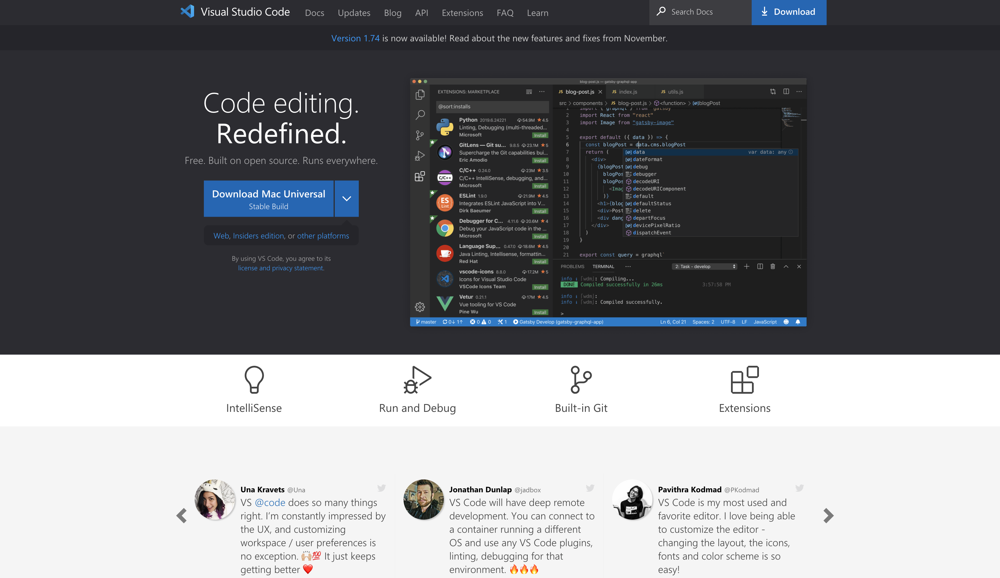
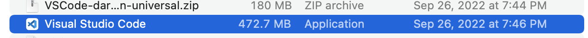
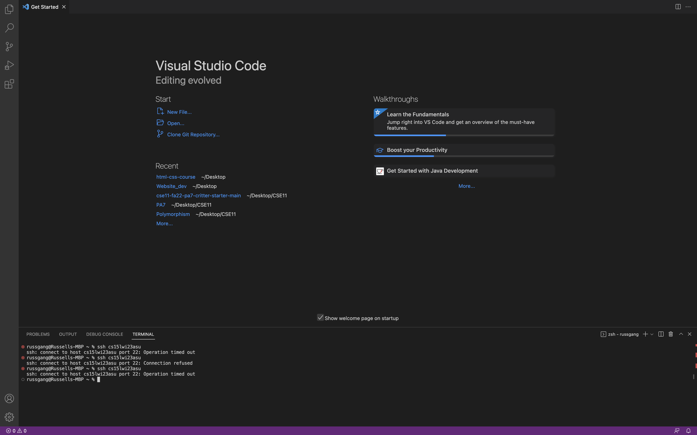
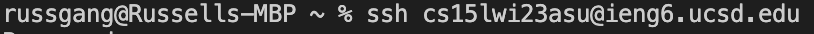
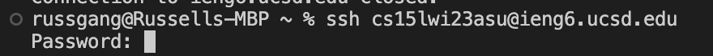
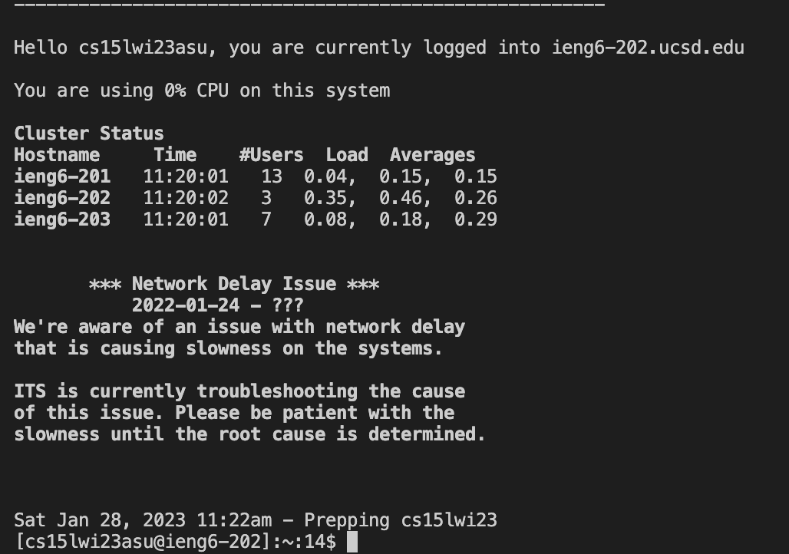

# Installing VS Code

First, head to [Visual Studio Code](https://code.visualstudio.com/) and follow the system specific instructions for either masOS or Windows. If you are working with a PC you will need to scroll down to the bottom of the page to find the download instructions.  

After VS code is downloaded, open your files and look for VS code Zip file. After you click on the zip file, a file named Visual Studio Code should be downloaded into your files. 

Once you click on the Visual Studio Code file in your files you should reach a home page that looks similar to the one below. To get started, you can either open an existing file or create a new one by clicking New File. 

# Remotely Connecting

Open the terminal in VS code.(Ctrl or Command + `, or use the Terminal → New Terminal menu option), and type in ssh followed by your account name.

If this is your first time logging in to the server, you should be met with a repsponse saying "Are you sure you want to continue connecting (yes/no/[fingerprint])?". Type yes, press enter, and then you should be met with a request to input your password as below. 

Once you have input your password, you should see a message similar to the one below. Notice how the server displays information like the different hosts and how many users are using those hosts. This can give you an idea of how fast or slow the server will be running.  

# Trying Some Commands

