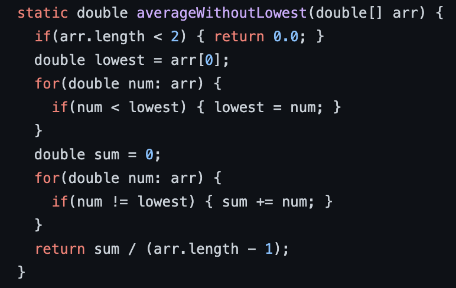

# averageWithoutLowest() Bug From Lab 3

One of the bugged programs that we fixed was the averageWithoutLowest() method. The original code is shown below. 

# Week 2-3 Learning Reflection 

One of the things that I learned from week 3 was how to create a web server. More specifically, I learned how to implement a server that responds to different URL inputs which can then output text on a web page. Further, I learned how to construct a program on the backend which can manipulate the output with different URL inputs. All in all, I learned that creating your own web server can be particularly beneficial when you want to share files/data with a specific group of people who have access to either your IP or hostname. 
