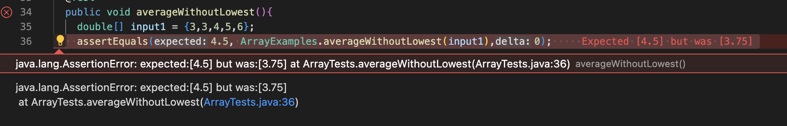

# Creating a Web Server

The code I used to created my StringServer is below. 

## Using add-messsage

I have not gotten my server to work as designed. However, when the code functions, my handleRequest method and my main method will be called, where the relevant arguments are always the URL since this program reads a URL input and outputs a message of text on the webpage. From each specific request, the String array which contains the message will be changed as well as the port number with each update of the host. 

# averageWithoutLowest() Bug From Lab 3

One of the bugged programs that we fixed was the averageWithoutLowest() method.

Failure inducing input: 

    public void averageWithoutLowest(){
      double[] input1 = {3,3,4,5,6}; 
      assertEquals(4.5, ArrayExamples.averageWithoutLowest(input1),0); 
    }

Success inducing input: 

    public void averageWithoutLowest(){
        double[] input1 = {7,3,4,5,6}; 
        assertEquals(5.5, ArrayExamples.averageWithoutLowest(input1),0); 
    }

The original bugged code: 

    static double averageWithoutLowest(double[] arr) {
        if(arr.length < 2) { return 0.0; }
        double lowest = arr[0];
        for(double num: arr) {
            if(num < lowest) { lowest = num; }
        }
        double sum = 0;
        for(double num: arr) {
            if(num != lowest) { sum += num; }
        }
        return sum / (arr.length - 1);
    }

The symptom: 

Fixed code: 

    static double averageWithoutLowest(double[] arr) {
        if(arr.length < 2) { return 0.0; }
        double lowest = arr[0];
        for(double num: arr) {
            if(num < lowest) { lowest = num; }
        }
        double sum = 0;
        boolean removedLowest = false;
        for(double num: arr) {
            if(num == lowest && removedLowest == false){
                removedLowest = true; 
                continue; 
            }
        sum += num; 
        }
        return sum / (arr.length - 1);
    }

By adding a boolean which detects when the lowest number has been removed, any other numbers which are equal to the lowest number will now be included in the sum of the average. This fixes the bug because previously, any other number that matched the lowest number would not count towards the sum, but would still be represented in the denominator. 

# Week 2-3 Learning Reflection 

One of the things that I learned from week 3 was how to create a web server. More specifically, I learned how to implement a server that responds to different URL inputs which can then output text on a web page. Further, I learned how to construct a program on the backend which can manipulate the output with different URL inputs. All in all, I learned that creating your own web server can be particularly beneficial when you want to share files/data with a specific group of people who have access to either your IP or hostname. 
