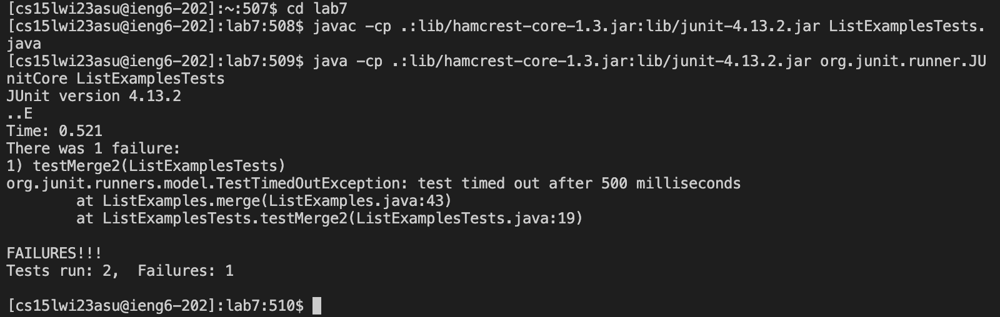
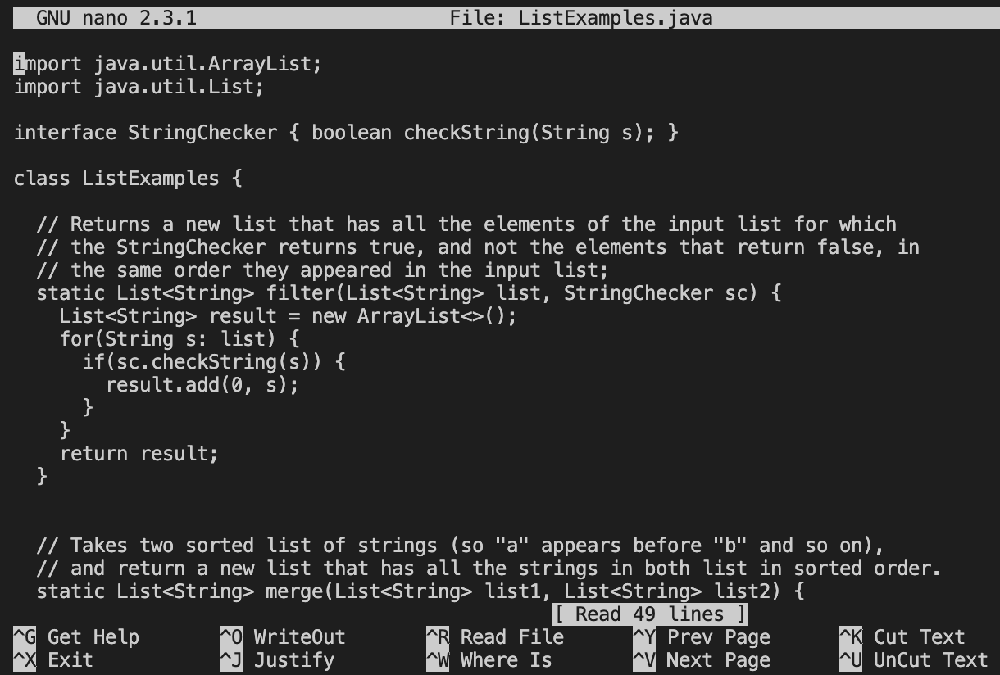

# "Done Quick" Challenge Task

## Step 4: Logging into ieng6

Log into your ieng6 account using the ssh command. If you have not generated an ssh key for your ieng6 account then you will need to input your password to login.

    ssh cs15lwi23asu@ieng6.ucsd.edu <enter>

## Step 5: Clone your fork of the repository from your Github account

In your github account, go to the lab7 file and find copy the SSH clone key as shown below.

Then enter the command as shown below. 

        git clone <Command-V><enter>
        

## Step 6: Run the tests, demonstrating that they fail

First, change into the lab7 directory using the command cd lab7. Then use the <Ctrl+R> command to search for previously entered commands and type javac to automatically input the compiler input for JUnit tests. The java -cp .:lib/hamcrest-core-1.3.jar:lib/junit-4.13.2.jar org.junit.runner.JUnitCore command was 4 up in the command history, so I pressed the up key 4 times and then enter to run it as shown below. 

        cd lab7
        <Ctrl+R> javac <enter>
        <up><up><up><up><enter>

## Step 7: Edit the code file to fix the failing test

Use nano to open the ListExamples.java file

        nano L<tab>.java

We want to fix the error located at line 43, so I used a shortcut outline below to find the correct line number and replace the 1 in index1 with a 2 to make it index2. I then used various nano commands to write out the edit and exit the file.

        <Ctrl + Shift + -> <42><enter> 
        <right> 12 times then <delete> and <2> 
        <Ctrl+O><enter><Ctrl+X> 
        
 
 
## Step 8: Run the tests, demonstrating that they now succeed

To demonstrate that the tests now succeed, we need to compile and run the JUnit tests just like in step 6. Now that these commands are more recent in our history, they are both reachable with 3 up arrows as shown below. 
    
        <up><up><up><enter> 
        <up><up><up><enter> 

## Step 9: Commit and push the resulting change to your Github account

I used the git add, commmit and push commands in order to update the correct verision of ListExamples.java to my Github account. 

        git add ListExmaples.java
        git commit -m "Updated"
        git push

        

