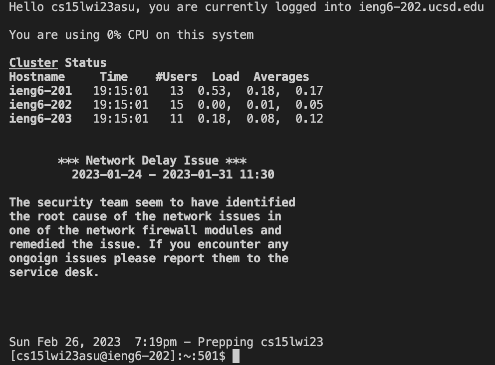
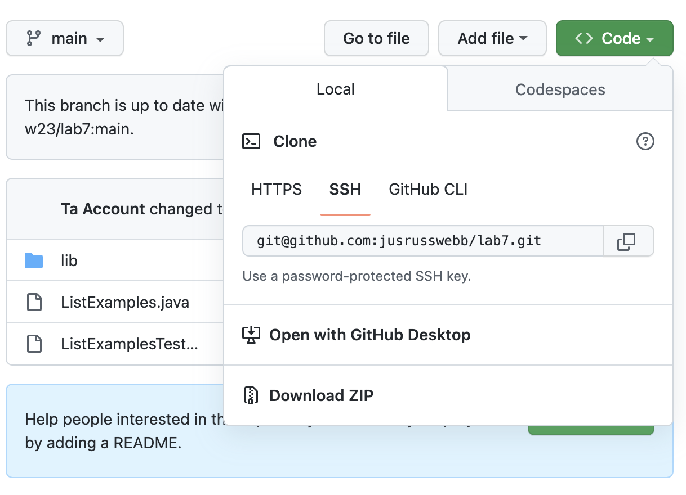
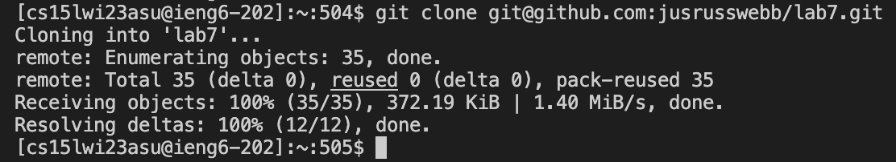

# "Done Quick" Challenge Task

## Step 4: Logging into ieng6

Log into your ieng6 account using the ssh command. If you have not generated an ssh key for your ieng6 account then you will need to input your password to login.

    ssh cs15lwi23asu@ieng6.ucsd.edu <enter>

## Step 5: Clone your fork of the repository from your Github account

In your github account, go to the lab7 file and find copy the SSH clone key as shown below.

Then enter the command as shown below. 

        git clone <Ctrl+V><enter>
        

